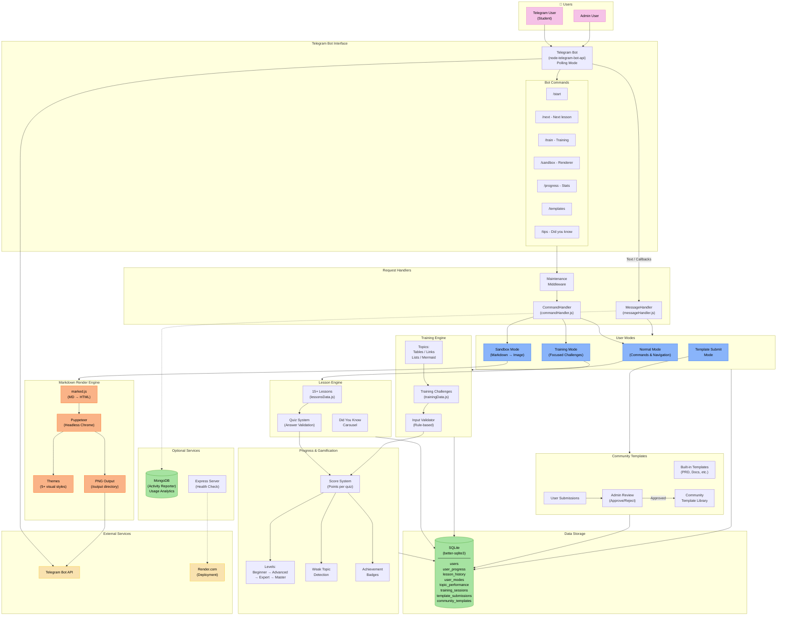
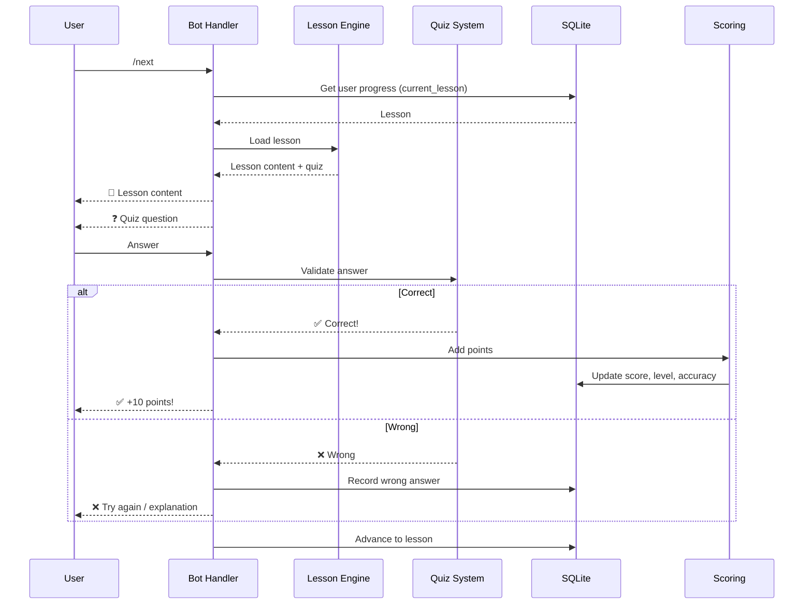
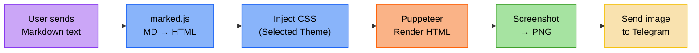
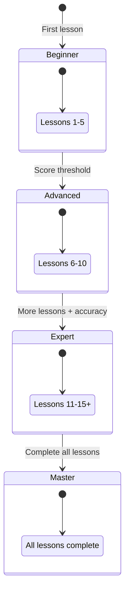

# Architecture Diagram - MarkdownBot

## System Overview

```mermaid
graph TB
    subgraph Users["👥 Users"]
        Student["Telegram User<br/>(Student)"]
        Admin["Admin User"]
    end

    subgraph TelegramInterface["Telegram Bot Interface"]
        TBot["Telegram Bot<br/>(node-telegram-bot-api)<br/>Polling Mode"]

        subgraph Commands["Bot Commands"]
            Start["/start"]
            Next["/next - Next lesson"]
            Train["/train - Training"]
            Sandbox["/sandbox - Renderer"]
            Progress["/progress - Stats"]
            Templates["/templates"]
            Tips["/tips - Did you know"]
        end
    end

    subgraph Handlers["Request Handlers"]
        CmdHandler["CommandHandler<br/>(commandHandler.js)"]
        MsgHandler["MessageHandler<br/>(messageHandler.js)"]
        Maintenance["Maintenance<br/>Middleware"]
    end

    subgraph Modes["User Modes"]
        NormalMode["Normal Mode<br/>(Commands & Navigation)"]
        SandboxMode["Sandbox Mode<br/>(Markdown → Image)"]
        TrainingMode["Training Mode<br/>(Focused Challenges)"]
        TemplateMode["Template Submit<br/>Mode"]
    end

    subgraph LessonEngine["Lesson Engine"]
        LessonsData["15+ Lessons<br/>(lessonsData.js)"]
        QuizSystem["Quiz System<br/>(Answer Validation)"]
        DidYouKnow["Did You Know<br/>Carousel"]
    end

    subgraph TrainingEngine["Training Engine"]
        TrainingData["Training Challenges<br/>(trainingData.js)"]
        TopicSelect["Topics:<br/>Tables / Links<br/>Lists / Mermaid"]
        Validator["Input Validator<br/>(Rule-based)"]
    end

    subgraph RenderEngine["Markdown Render Engine"]
        Marked["marked.js<br/>(MD → HTML)"]
        Puppeteer["Puppeteer<br/>(Headless Chrome)"]
        Themes["Themes<br/>(5+ visual styles)"]
        PNGOutput["PNG Output<br/>(/output directory)"]
    end

    subgraph TemplateSystem["Community Templates"]
        TemplatesData["Built-in Templates<br/>(PRD, Docs, etc.)"]
        Submissions["User Submissions"]
        AdminReview["Admin Review<br/>(Approve/Reject)"]
        Community["Community<br/>Template Library"]
    end

    subgraph Gamification["Progress & Gamification"]
        Scoring["Score System<br/>(Points per quiz)"]
        Levels["Levels:<br/>Beginner → Advanced<br/>→ Expert → Master"]
        WeakTopics["Weak Topic<br/>Detection"]
        Badges["Achievement<br/>Badges"]
    end

    subgraph Storage["Data Storage"]
        SQLite[("SQLite<br/>(better-sqlite3)<br/>─────────────<br/>users<br/>user_progress<br/>lesson_history<br/>user_modes<br/>topic_performance<br/>training_sessions<br/>template_submissions<br/>community_templates")]
    end

    subgraph Optional["Optional Services"]
        MongoDB[("MongoDB<br/>(Activity Reporter)<br/>Usage Analytics")]
        Express["Express Server<br/>(Health Check)"]
    end

    subgraph External["External Services"]
        TelegramAPI["Telegram Bot API"]
        RenderCom["Render.com<br/>(Deployment)"]
    end

    %% User flow
    Student --> TBot
    Admin --> TBot

    %% Command routing
    TBot --> Commands
    Commands --> Maintenance
    Maintenance --> CmdHandler
    TBot -->|"Text / Callbacks"| MsgHandler

    %% Mode routing
    CmdHandler --> NormalMode
    CmdHandler --> SandboxMode
    CmdHandler --> TrainingMode
    MsgHandler --> Modes

    %% Lesson flow
    NormalMode --> LessonEngine
    LessonsData --> QuizSystem
    QuizSystem --> Scoring

    %% Training flow
    TrainingMode --> TrainingEngine
    TopicSelect --> TrainingData
    TrainingData --> Validator
    Validator --> Scoring

    %% Sandbox flow
    SandboxMode --> RenderEngine
    Marked --> Puppeteer
    Puppeteer --> Themes
    Puppeteer --> PNGOutput

    %% Template flow
    TemplateMode --> TemplateSystem
    Submissions --> AdminReview
    AdminReview -->|"Approved"| Community

    %% Gamification
    Scoring --> Levels
    Scoring --> WeakTopics
    Scoring --> Badges

    %% Storage
    LessonEngine --> SQLite
    TrainingEngine --> SQLite
    Gamification --> SQLite
    TemplateSystem --> SQLite
    Modes --> SQLite

    %% Optional
    MsgHandler -.-> MongoDB
    Express -.-> RenderCom

    %% External
    TBot --> TelegramAPI
    PNGOutput --> TelegramAPI

    %% Styling
    classDef external fill:#f9e2af,stroke:#f5c211,color:#000
    classDef storage fill:#a6e3a1,stroke:#40a02b,color:#000
    classDef mode fill:#89b4fa,stroke:#1e66f5,color:#000
    classDef user fill:#f5c2e7,stroke:#ea76cb,color:#000
    classDef render fill:#fab387,stroke:#fe640b,color:#000

    class TelegramAPI,RenderCom external
    class SQLite,MongoDB storage
    class NormalMode,SandboxMode,TrainingMode,TemplateMode mode
    class Student,Admin user
    class Marked,Puppeteer,Themes,PNGOutput render
```

## Lesson & Training Flow

```mermaid
sequenceDiagram
    participant U as User
    participant Bot as Bot Handler
    participant LE as Lesson Engine
    participant Quiz as Quiz System
    participant DB as SQLite
    participant Score as Scoring

    U->>Bot: /next
    Bot->>DB: Get user progress (current_lesson)
    DB-->>Bot: Lesson #N
    Bot->>LE: Load lesson #N
    LE-->>Bot: Lesson content + quiz
    Bot-->>U: 📖 Lesson content
    Bot-->>U: ❓ Quiz question

    U->>Bot: Answer
    Bot->>Quiz: Validate answer

    alt Correct
        Quiz-->>Bot: ✅ Correct!
        Bot->>Score: Add points
        Score->>DB: Update score, level, accuracy
        Bot-->>U: ✅ +10 points!
    else Wrong
        Quiz-->>Bot: ❌ Wrong
        Bot->>DB: Record wrong answer
        Bot-->>U: ❌ Try again / explanation
    end

    Bot->>DB: Advance to lesson #N+1
```

## Sandbox Rendering Pipeline

```mermaid
graph LR
    A["User sends<br/>Markdown text"] --> B["marked.js<br/>MD → HTML"]
    B --> C["Inject CSS<br/>(Selected Theme)"]
    C --> D["Puppeteer<br/>Render HTML"]
    D --> E["Screenshot<br/>→ PNG"]
    E --> F["Send image<br/>to Telegram"]

    style A fill:#cba6f7,stroke:#8839ef,color:#000
    style B fill:#89b4fa,stroke:#1e66f5,color:#000
    style C fill:#89b4fa,stroke:#1e66f5,color:#000
    style D fill:#fab387,stroke:#fe640b,color:#000
    style E fill:#a6e3a1,stroke:#40a02b,color:#000
    style F fill:#f9e2af,stroke:#f5c211,color:#000
```

## User Level Progression

```mermaid
stateDiagram-v2
    [*] --> Beginner: First lesson
    Beginner --> Advanced: Score threshold
    Advanced --> Expert: More lessons + accuracy
    Expert --> Master: Complete all lessons

    state Beginner {
        [*] --> Lessons1_5
        Lessons1_5: Lessons 1-5
    }

    state Advanced {
        [*] --> Lessons6_10
        Lessons6_10: Lessons 6-10
    }

    state Expert {
        [*] --> Lessons11_15
        Lessons11_15: Lessons 11-15+
    }

    state Master {
        [*] --> AllComplete
        AllComplete: All lessons complete
    }
```
