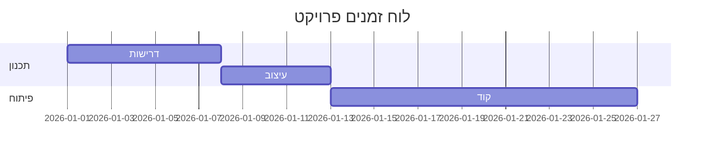

# 📖 הצעות להרחבת תוכן הלימוד - Markdown Trainer Bot

> מסמך זה מתמקד בהרחבת התוכן החינוכי של הבוט - שיעורים חדשים, נושאים מתקדמים, ודרכי למידה משופרות.

---

## 📋 תוכן עניינים
1. [מצב נוכחי](#-מצב-נוכחי)
2. [נושאים לימודיים חסרים](#-נושאים-לימודיים-חסרים)
3. [שיעורים מתקדמים מוצעים](#-שיעורים-מתקדמים-מוצעים)
4. [מסלולי למידה ממוקדים](#-מסלולי-למידה-ממוקדים)
5. [תרגילים מעשיים חדשים](#-תרגילים-מעשיים-חדשים)
6. [הרחבות למעבדת התרגול](#-הרחבות-למעבדת-התרגול)
7. [תוכן משלים](#-תוכן-משלים)
8. [רעיון: ווב אפ אינטראקטיבי](#-רעיון-ווב-אפ-אינטראקטיבי)

---

## 📊 מצב נוכחי

**תוכן קיים בבוט:**
- ✅ 14 שיעורים (בסיס + מתקדם + אסתטיקה)
- ✅ 25 טיפים וטריקים
- ✅ 28 אתגרי אימון ב-6 קטגוריות
- ✅ 8 תבניות מקצועיות
- ✅ מעבדת תרגול (Sandbox)
- ✅ "הידעת?" (Did You Know)

**פערים מזוהים:**
- ⚠️ חסרים נושאים ספציפיים לפלטפורמות (GitHub, GitLab, Notion)
- ⚠️ אין תרגול על פרויקטים אמיתיים
- ⚠️ חסר תוכן על Markdown flavors שונים
- ⚠️ אין שיעורים על אופטימיזציה וביצועים
- ⚠️ חסרים מקרי שימוש מתקדמים (בלוגים, תיעוד טכני, מצגות)

---

## 🎯 נושאים לימודיים חסרים

### 1. **GitHub Flavored Markdown (GFM)**
**מה חסר:**
- Alerts מיוחדים של GitHub (`[!NOTE]`, `[!WARNING]`)
- Syntax highlighting מתקדם
- Task lists עם sub-tasks
- Mentions (@username) ו-Issue references (#123)
- Emojis (:smile:)
- Color swatches (`` `#0969DA` ``)

**למה חשוב:**
- רוב המפתחים משתמשים ב-GitHub יומיומית
- Issues, PRs ו-README files צריכים ידע ספציפי

**רמת קושי:** בינונית
**זמן פיתוח:** 2-3 שיעורים

---

### 2. **GitLab Markdown**
**מה חסר:**
- Video embedding (``)
- Math equations עם `$...$` ו-`$$...$$`
- Mermaid diagrams נוספים (Gantt, ER)
- Charts ו-graphs
- TOC אוטומטי (`[[_TOC_]]`)

**למה חשוב:**
- GitLab משמש ארגונים רבים
- תכונות ייחודיות שלא קיימות ב-GitHub

**רמת קושי:** בינונית-גבוהה
**זמן פיתוח:** 2 שיעורים

---

### 3. **Markdown לבלוגים (Medium, DEV.to, Hashnode)**
**מה חסר:**
- Front Matter (YAML metadata)
- Canonical URLs
- Series/Collections
- Tags ו-Categories
- Code embedding (CodePen, Replit)
- Social embeds (Twitter, YouTube)

**למה חשוב:**
- כותבי בלוגים טכניים זו קהל יעד גדול
- כל פלטפורמה עם מוסכמות שונות

**רמת קושי:** נמוכה-בינונית
**זמן פיתוח:** 2-3 שיעורים

---

### 4. **Markdown למצגות (Marp, Reveal.js)**
**מה חסר:**
- Slide separators (`---`, `----`)
- Speaker notes
- Fragments (הופעה הדרגתית)
- Layouts מיוחדים
- Backgrounds (תמונות, צבעים, gradients)
- Vertical slides

**למה חשוב:**
- מרצים ומציגים יכולים ליצור מצגות מהירות
- חיסכון בזמן vs PowerPoint

**רמת קושי:** בינונית
**זמן פיתוח:** 2 שיעורים

---

### 5. **Markdown לתיעוד טכני (Docusaurus, MkDocs)**
**מה חסר:**
- Admonitions (:::note, :::warning, :::tip)
- Tabs (ריבוי דוגמאות קוד)
- Include files (`!include`)
- API documentation patterns
- Versioning indicators
- Search optimization

**למה חשוב:**
- מפתחים כותבים תיעוד טכני
- כלי בניית תיעוד זו תעשייה שלמה

**רמת קושי:** בינונית-גבוהה
**זמן פיתוח:** 3-4 שיעורים

---

### 6. **Markdown לרשימות ומחברות (Obsidian, Notion, Logseq)**
**מה חסר:**
- Bidirectional links (`[[page]]`)
- Backlinks
- Tags (#tag, #nested/tag)
- Block references
- Queries ו-filters
- DataView (Obsidian specific)

**למה חשוב:**
- מערכות ניהול ידע (PKM) פופולריות מאוד
- למידה לכל החיים (LLL)

**רמת קושי:** בינונית
**זמן פיתוח:** 2-3 שיעורים

---

### 7. **Markdown לאימייל (Gmail, Markdown Here)**
**מה חסר:**
- עיצוב נקי ומינימלי
- טיפים לקריאות באימייל
- HTML fallback
- Inline styles
- Responsive design
- Plain text fallback

**למה חשוב:**
- אנשים שולחים הרבה אימיילים טכניים
- Markdown Here הוא כלי פופולרי

**רמת קושי:** נמוכה
**זמן פיתוח:** 1 שיעור

---

### 8. **נגישות (Accessibility) ב-Markdown**
**מה חסר:**
- Alt Text איכותי (מה עושה אלט טקסט טוב?)
- Semantic headings (למה לא לדלג על H2?)
- ARIA labels ב-HTML מוטמע
- ניגודיות וצבעים
- טקסט תיאורי לקישורים (לא "לחץ כאן")
- טבלאות נגישות (headers, scope)

**למה חשוב:**
- נגישות זו חובה, לא אופציה
- משפרת חווית משתמש לכולם

**רמת קושי:** בינונית
**זמן פיתוח:** 2 שיעורים

---

### 9. **ביצועים ואופטימיזציה**
**מה חסר:**
- תמונות ממוטבות (WebP, responsive)
- Lazy loading
- קישורים יחסיים vs. מוחלטים
- CDN לתמונות
- Minification
- קבצים קטנים vs. קובץ ענק

**למה חשוב:**
- מסמכים כבדים איטיים לטעינה
- SEO ו-Core Web Vitals

**רמת קושי:** גבוהה
**זמן פיתוח:** 2 שיעורים

---

### 10. **שיתוף פעולה ו-Git workflows**
**מה חסר:**
- כתיבת PR descriptions
- Conventional commits ב-CHANGELOG
- Code review comments
- Issue templates
- Wiki pages
- Discussion boards

**למה חשוב:**
- כל מפתח כותב PRs
- תקשורת צוותית טובה

**רמת קושי:** נמוכה-בינונית
**זמן פיתוח:** 2 שיעורים

---

## 🚀 שיעורים מתקדמים מוצעים

### שיעור 15: GitHub Alerts והתראות מתקדמות
**תוכן:**
```markdown
> [!NOTE]
> מידע שימושי למשתמש

> [!TIP]
> טיפ מועיל

> [!IMPORTANT]
> מידע קריטי

> [!WARNING]
> אזהרה לתשומת לב

> [!CAUTION]
> סיכון או תוצאה שלילית
```

**תרגיל:**
יצירת README עם 3 סוגי alerts שונים.

**ניקוד:** 10 נקודות

---

### שיעור 16: Front Matter ו-Metadata
**תוכן:**
```markdown
---
title: "כותרת הפוסט שלי"
date: 2026-02-15
tags: [markdown, tutorial, hebrew]
author: Your Name
description: תיאור קצר לשיתוף
---

# תוכן הפוסט...
```

**תרגיל:**
יצירת פוסט בלוג עם Front Matter מלא.

**ניקוד:** 12 נקודות

---

### שיעור 17: Tabs לדוגמאות קוד
**תוכן:**
````markdown
:::tabs
== JavaScript
```js
console.log('Hello');
```
== Python
```py
print('Hello')
```
== Ruby
```rb
puts 'Hello'
```
:::
````

**תרגיל:**
יצירת 3 tabs עם דוגמאות קוד שונות.

**ניקוד:** 15 נקודות

---

### שיעור 18: Bidirectional Links (Obsidian Style)
**תוכן:**
```markdown
# הערה ראשית

קישור לדף אחר: [[Markdown Guide]]
קישור עם טקסט מותאם: [[Markdown Guide|המדריך שלי]]

Tags: #למידה #markdown #obsidian

Block reference: ^block-id
```

**תרגיל:**
יצירת רשת של 3 הערות מקושרות.

**ניקוד:** 15 נקודות

---

### שיעור 19: Mermaid מתקדם - Gantt ו-ER
**תוכן:**
````markdown

````

**תרגיל:**
יצירת Gantt chart לפרויקט בן 3 שלבים.

**ניקוד:** 20 נקודות

---

### שיעור 20: נגישות - Alt Text ו-Semantic Markup
**תוכן:**
- מה זה Alt Text טוב לעומת רע?
- למה לא לדלג על רמות כותרות?
- קישורים תיאוריים (לא "לחץ כאן")
- טבלאות עם headers נכונים

**דוגמה:**
```markdown
❌ לא טוב:

[לחץ כאן](https://example.com)

✅ טוב:

[הורד את המדריך המלא ל-Markdown](https://example.com)
```

**תרגיל:**
תקן 5 דוגמאות של תוכן לא נגיש.

**ניקוד:** 12 נקודות

---

### שיעור 21: כתיבת PR Description מושלם
**תוכן:**
```markdown
## מה?
תיאור קצר של השינוי

## למה?
הבעיה שפתרנו

## איך?
הפתרון הטכני

## בדיקות
- [ ] Unit tests עוברים
- [ ] Lint נקי
- [ ] נבדק ידנית

## צילומי מסך
 

## קישורים
Closes #123
Related to #456
```

**תרגיל:**
כתוב PR description מלא לפיצ'ר דמה.

**ניקוד:** 15 נקודות

---

### שיעור 22: Markdown למצגות - Slide Deck בסיסי
**תוכן:**
```markdown
---
theme: default
---

# כותרת ראשית
מצגת ב-Markdown

---

## שקף 2
תוכן השקף

- נקודה 1
- נקודה 2

---

## שקף 3 עם קוד
```js
function hello() {
  console.log('World');
}
```
```

**תרגיל:**
צור מצגת בת 5 שקפים עם כותרת, רשימה, קוד ותמונה.

**ניקוד:** 18 נקודות

---

### שיעור 23: Admonitions (הערות צבעוניות)
**תוכן:**
```markdown
:::note
זהו מידע שימושי
:::

:::tip טיפ מועיל
תמיד בדוק את הקוד שלך!
:::

:::warning
שים לב לנקודה זו
:::

:::danger ⚠️ סכנה
אל תעשה את זה בייצור!
:::
```

**תרגיל:**
צור מסמך עם 4 סוגי admonitions שונים.

**ניקוד:** 10 נקודות

---

### שיעור 24: תמונות ממוטבות ו-Responsive
**תוכן:**
```markdown
<!-- תמונה רגילה -->


<!-- תמונה עם גובה/רוחב -->


<!-- תמונה responsive -->
<picture>
  <source media="(min-width: 800px)" srcset="large.jpg">
  <source media="(min-width: 400px)" srcset="medium.jpg">
  
</picture>

<!-- Lazy loading -->

```

**תרגיל:**
הטמע 3 תמונות: רגילה, עם רוחב קבוע, ו-lazy loading.

**ניקוד:** 12 נקודות

---

### שיעור 25: Math Equations (משוואות מתמטיות)
**תוכן:**
```markdown
Inline math: $E = mc^2$

Block math:
$$
\int_{a}^{b} f(x) dx = F(b) - F(a)
$$

מטריצה:
$$
\begin{bmatrix}
a & b \\
c & d
\end{bmatrix}
$$
```

**תרגיל:**
כתוב 3 משוואות: פשוטה, שבר, ומטריצה.

**ניקוד:** 18 נקודות

---

## 🎓 מסלולי למידה ממוקדים

במקום לימוד ליניארי, אפשר ליצור **מסלולים** לפי מטרת השימוש:

### 🐙 מסלול 1: GitHub Master
**מטרה:** שליטה ב-Markdown לצורכי GitHub

**שיעורים בסדר:**
1. כותרות ורשימות (קיים)
2. קישורים ותמונות (קיים)
3. קוד וקווים מפרידים (קיים)
4. טבלאות (קיים)
5. **GitHub Alerts** (חדש - שיעור 15)
6. **Task Lists מתקדמות** (הרחבה)
7. Mermaid Diagrams (קיים)
8. **PR Descriptions** (חדש - שיעור 21)
9. **Issue Templates** (חדש)

**משך זמן:** 12 שיעורים
**רמת קושי:** בינונית
**קהל יעד:** מפתחים, תורמים ל-OSS

---

### ✍️ מסלול 2: Technical Blogger
**מטרה:** כתיבת פוסטים טכניים באיכות גבוהה

**שיעורים בסדר:**
1. כותרות (קיים)
2. הדגשות ורשימות (קיים)
3. קישורים ותמונות (קיים)
4. ציטוטים (קיים)
5. **Front Matter** (חדש - שיעור 16)
6. **Code Tabs** (חדש - שיעור 17)
7. **תמונות ממוטבות** (חדש - שיעור 24)
8. Mermaid (קיים)
9. **נגישות** (חדש - שיעור 20)

**משך זמן:** 10 שיעורים
**רמת קושי:** נמוכה-בינונית
**קהל יעד:** כותבי בלוגים, מרצים

---

### 📖 מסלול 3: Documentation Pro
**מטרה:** כתיבת תיעוד טכני מקצועי

**שיעורים בסדר:**
1. כותרות ומבנה (קיים)
2. קישורים ותמונות (קיים)
3. טבלאות (קיים)
4. קוד (קיים)
5. **Admonitions** (חדש - שיעור 23)
6. **Code Tabs** (חדש - שיעור 17)
7. **TOC אוטומטי** (חדש)
8. Mermaid (קיים)
9. **נגישות** (חדש - שיעור 20)
10. **API Reference** (הרחבת תבנית קיימת)

**משך זמן:** 12 שיעורים
**רמת קושי:** בינונית-גבוהה
**קהל יעד:** Technical Writers, מפתחים

---

### 📝 מסלול 4: Note-Taking Master
**מטרה:** ניהול ידע אישי (PKM) עם Markdown

**שיעורים בסדר:**
1. כותרות ורשימות (קיים)
2. קישורים פשוטים (קיים)
3. **Bidirectional Links** (חדש - שיעור 18)
4. **Tags** (חדש)
5. **Block References** (חדש)
6. **Daily Notes** (חדש)
7. **Templates** (הרחבה)
8. **Queries** (חדש)

**משך זמן:** 8 שיעורים
**רמת קושי:** בינונית
**קהל יעד:** סטודנטים, חובבי Obsidian/Notion

---

### 🎤 מסלול 5: Presentation Creator
**מטרה:** יצירת מצגות מהירות ומעוצבות

**שיעורים בסדר:**
1. כותרות (קיים)
2. רשימות והדגשות (קיים)
3. תמונות (קיים)
4. קוד (קיים)
5. **Slide Separators** (חדש - שיעור 22)
6. **Fragments** (חדש)
7. **Backgrounds** (חדש)
8. Mermaid (קיים)

**משך זמן:** 8 שיעורים
**רמת קושי:** נמוכה-בינונית
**קהל יעד:** מרצים, מציגים

---

## 🧪 תרגילים מעשיים חדשים

### סוג 1: פרויקטים מציאותיים

#### תרגיל: כתיבת README לפרויקט קוד פתוח
**תיאור:**
- קבל תיאור פרויקט דמה (למשל: "Todo App ב-React")
- כתוב README מלא: כותרת, תיאור, התקנה, שימוש, תרומה, רישיון
- הכלל: באדג'ים, טבלה, קוד, צילומי מסך

**הערכה:**
- ✅ כל הסעיפים הנדרשים קיימים
- ✅ תחביר Markdown תקין
- ✅ קריאות ומבנה
- ✅ דוגמאות קוד עובדות

**ניקוד:** 30 נקודות

---

#### תרגיל: PR Description לפיצ'ר גדול
**תיאור:**
- תיאור פיצ'ר: "הוספת מצב כהה לאפליקציה"
- כתוב PR description עם: מה? למה? איך? בדיקות? צילומי מסך?

**הערכה:**
- ✅ כל הסעיפים מלאים
- ✅ Task list עם בדיקות
- ✅ קישורים ל-issues רלוונטיים

**ניקוד:** 20 נקודות

---

#### תרגיל: פוסט בלוג טכני
**תיאור:**
- כתוב פוסט קצר (300 מילים) על "למה אני אוהב Markdown"
- כלול: Front Matter, כותרת, 2 פסקאות, רשימה, blockquote, קוד

**הערכה:**
- ✅ Front Matter תקין
- ✅ מבנה ברור
- ✅ שילוב אלמנטים שונים

**ניקוד:** 25 נקודות

---

#### תרגיל: תיעוד API Endpoint
**תיאור:**
- תעד endpoint דמה: `POST /api/users`
- כלול: תיאור, פרמטרים, דוגמת request/response, error codes

**הערכה:**
- ✅ כל המידע הנדרש
- ✅ טבלאות לפרמטרים
- ✅ code blocks עם syntax highlighting

**ניקוד:** 25 נקודות

---

### סוג 2: אתגרי Debugging (מציאת וטיקון באגים)

#### אתגר: README שבור
**תיאור:**
נתון קובץ README עם 10 שגיאות:
- כותרת ללא רווח
- קישור שבור (סוגריים לא מחוברים)
- טבלה חסרה `|` בהתחלה
- קוד ללא backticks
- תמונה ללא Alt Text
- רשימה ללא רווח אחרי `-`
- וכו'

**משימה:** מצא ותקן את כל השגיאות

**ניקוד:** 20 נקודות (2 לכל באג)

---

#### אתגר: PR עם Markdown לא תקין
**תיאור:**
נתון PR description עם שגיאות:
- Task list עם סינטקס שגוי
- code block לא סגור
- טבלה עם יישור שגוי

**משימה:** תקן את כל השגיאות

**ניקוד:** 15 נקודות

---

### סוג 3: אתגרי שיפור (Refactoring)

#### אתגר: שפר את הקריאות
**תיאור:**
נתון מסמך Markdown צפוף ולא קריא (ללא רווחים, כותרות לא ברורות, רשימות ארוכות)

**משימה:**
- הוסף רווחים
- שפר כותרות
- פצל רשימות ארוכות
- הוסף קווים מפרידים
- הוסף TOC

**ניקוד:** 20 נקודות

---

#### אתגר: הנגש את התוכן
**תיאור:**
נתון מסמך עם בעיות נגישות:
- תמונות ללא Alt Text
- קישורים "לחץ כאן"
- דילוג על רמות כותרות
- טבלה ללא headers

**משימה:** תקן את כל בעיות הנגישות

**ניקוד:** 20 נקודות

---

## 🧪 הרחבות למעבדת התרגול (Sandbox)

### רעיון 1: מצב "השוואה" (Before/After)
**מה?**
- אפשרות לראות קוד ותוצאה זה לצד זה
- שני panels: שמאל = קוד, ימין = תוצאה

**למה?**
- למידה ויזואלית
- הבנה מיידית של השפעת שינויים

**קושי יישום:** נמוך (רק עיצוב של התמונה)

---

### רעיון 2: מצב "תיקון אתגרים"
**מה?**
- הבוט שולח קוד שבור
- המשתמש צריך לתקן אותו
- הבוט בודק אם התיקון נכון

**דוגמה:**
```
בוט: תקן את הקוד הזה:
#כותרת
-רשימה
[קישור]example.com

משתמש שולח:
# כותרת
- רשימה
[קישור](https://example.com)

בוט: ✅ מצוין! כל השגיאות תוקנו.
```

**קושי יישום:** בינוני (צריך validation logic)

---

### רעיון 3: מצב "מדריך מונחה"
**מה?**
- למידה step-by-step בתוך הסנדבוקס
- "עכשיו הוסף כותרת" → משתמש מוסיף → בוט מאשר
- "עכשיו הוסף רשימה" → וכו'

**למה?**
- למידה מונחית לאנשים שצריכים יותר עזרה
- בניית ביטחון הדרגתי

**קושי יישום:** בינוני-גבוה (צריך state machine)

---

### רעיון 4: ספריית דוגמאות
**מה?**
- אוסף של 50+ דוגמאות Markdown מוכנות
- קטגוריות: GitHub, Blogging, Docs, Presentations
- משתמש יכול לטעון דוגמה ולשנות

**דוגמאות מוצעות:**
- README.md של פרויקט React
- PR description לבאג פיקס
- פוסט בלוג עם Front Matter
- Issue template
- Mermaid flowchart מורכב
- API documentation
- Slide deck
- Meeting notes

**קושי יישום:** נמוך (רק תוכן)

---

### רעיון 5: Export Options
**מה?**
- ייצוא הקוד שנוצר ב-sandbox
- פורמטים: `.md`, `.html`, `.pdf`, `.png`

**למה?**
- משתמש יכול לשמור את העבודה שלו
- שימושי למי שמתרגל לפרויקט אמיתי

**קושי יישום:** בינוני (PDF דורש Puppeteer - כבר קיים)

---

## 📚 תוכן משלים

### "הידעת?" (Did You Know) - הרחבה
**כמות קיימת:** לא ידוע (צריך לבדוק את `didYouKnowData.js`)

**הצעות לתוספות (50 עובדות חדשות):**

1. Markdown נוצר ב-2004 על ידי John Gruber ו-Aaron Swartz
2. השם "Markdown" הוא משחק מילים מול "Markup"
3. קובץ `.md` תמיד צריך להיות ב-UTF-8
4. GitHub מעבד 100 מיליון קבצי Markdown ביום
5. ניתן לכתוב Markdown ב-WhatsApp (*, _, ~)
6. Reddit משתמש ב-Markdown לתגובות
7. Discord תומך ב-Markdown לעיצוב הודעות
8. ניתן להמיר Word ל-Markdown עם Pandoc
9. Obsidian הוא אחד האפליקציות הפופולריות ביותר לניהול Markdown
10. ניתן לכתוב ספר שלם ב-Markdown (ולהמיר ל-ePub)
... (עוד 40)

**קושי יישום:** נמוך (רק תוכן)

---

### Cheatsheet - הרחבה
**מה קיים:** Cheatsheet בסיסי

**הרחבות מוצעות:**
- Cheatsheet לפי פלטפורמה (GitHub / GitLab / Notion)
- Cheatsheet לפי שימוש (Blogging / Docs / Presentations)
- PDF להורדה
- גרסה לדפוס (print-friendly)

**קושי יישום:** נמוך-בינוני

---

### תבניות (Templates) - הרחבה
**מה קיים:** 8 תבניות

**הצעות לתבניות חדשות:**

1. **Issue Template** (GitHub)
2. **Pull Request Template** (GitHub)
3. **Bug Report** (Issue)
4. **Feature Request** (Issue)
5. **Contributing Guidelines** (CONTRIBUTING.md)
6. **Code of Conduct** (CODE_OF_CONDUCT.md)
7. **Security Policy** (SECURITY.md)
8. **Changelog** (CHANGELOG.md)
9. **Slide Deck** (Marp template)
10. **Daily Note** (Obsidian style)
11. **Weekly Review** (GTD)
12. **Retro Notes** (Retrospective)
13. **Design Doc** (RFC style)
14. **Wiki Page** (GitHub Wiki)
15. **Email Newsletter** (Technical)

**קושי יישום:** נמוך (רק תוכן)

---

## 🌐 רעיון: ווב אפ אינטראקטיבי

### סקירה כללית

**מה?**
אתר ווב אינטראקטיבי ללימוד Markdown עם עורך בזמן אמת.

**למה?**
- חוויה עשירה יותר מבוט טלגרם
- יכולות UI/UX מתקדמות
- נגישות למי שלא משתמש בטלגרם
- SEO טוב יותר (חשיפה גבוהה יותר)

**האם זה מורכב מדי?**
תלוי בגישה:
- ✅ **גרסה פשוטה** (1-2 שבועות) - אפשרי ומומלץ
- ⚠️ **גרסה מלאה** (2-3 חודשים) - מורכב

---

### גישה 1: MVP פשוט (מומלץ לתחילה)

**תכונות:**
1. **עורך Markdown** (Split view: קוד | תצוגה)
   - Textarea משמאל
   - Preview מימין (עם Marked.js)
   - עדכון בזמן אמת

2. **שיעורים ליניאריים**
   - תוכן השיעורים הקיימים
   - כפתורי "הבא/קודם"
   - Progress bar

3. **Sandbox פשוט**
   - רק עריכה + תצוגה
   - כפתור "העתק Markdown"
   - כפתור "שמור כ-PDF"

4. **Cheatsheet**
   - טבלה אינטראקטיבית
   - לחיצה על דוגמה = העתקה

**טכנולוגיות:**
- **Frontend:** HTML, CSS, JavaScript (vanilla או Vue/React פשוט)
- **Markdown Parser:** Marked.js
- **Syntax Highlighting:** Prism.js או Highlight.js
- **PDF Export:** jsPDF או html2pdf
- **Hosting:** Vercel, Netlify, או GitHub Pages (חינם!)

**זמן פיתוח:** 7-14 ימים
**עלות:** 0 ₪ (hosting חינמי)
**קושי:** בינוני

---

### גישה 2: גרסה מלאה (לעתיד)

**תכונות נוספות:**
1. **התחברות משתמשים** (Firebase Auth)
2. **שמירת התקדמות בענן**
3. **מערכת ניקוד ודרגות**
4. **אתגרים יומיים**
5. **לוח מובילים**
6. **שיתוף תוצאות ברשתות**
7. **מצב קבוצתי / תחרויות**
8. **AI Feedback** (ChatGPT API)
9. **תמיכה רב-לשונית**
10. **Mobile app** (PWA)

**טכנולוגיות:**
- **Backend:** Node.js + Express (או Supabase)
- **Database:** PostgreSQL / MongoDB
- **Auth:** Firebase / Auth0
- **AI:** OpenAI API
- **Analytics:** Google Analytics / Plausible

**זמן פיתוח:** 2-3 חודשים
**עלות:** $20-50/חודש (hosting + DB + AI)
**קושי:** גבוה

---

### תכנון מומלץ: Hybrid

**שלב 1:** פתח MVP פשוט (Web App סטטי)
- זמן: 2 שבועות
- תכונות: עורך, שיעורים, Cheatsheet

**שלב 2:** שמור את הבוט כמקור האמת
- הבוט = הפלטפורמה העיקרית
- האתר = כלי עזר משלים

**שלב 3:** אם יש ביקוש - הרחב את האתר
- הוסף Auth
- הוסף שמירת התקדמות
- הוסף תכונות חברתיות

**יתרונות:**
- לא זונחים את הבוט (שהוא עובד מצוין)
- הווב אפ משמש כ-landing page ומשפך רכישה
- ניתן לפתח בהדרגה

---

### דוגמת Structure לווב אפ MVP

```
markdown-trainer-web/
├── index.html          # דף בית
├── lessons.html        # רשימת שיעורים
├── lesson.html         # עמוד שיעור בודד
├── sandbox.html        # מעבדת תרגול
├── cheatsheet.html     # מדריך מהיר
├── about.html          # אודות
│
├── css/
│   ├── style.css       # עיצוב ראשי
│   └── themes.css      # נושאים (Light/Dark)
│
├── js/
│   ├── app.js          # לוגיקה ראשית
│   ├── editor.js       # עורך Markdown
│   ├── lessons.js      # נתוני שיעורים
│   └── utils.js        # פונקציות עזר
│
└── assets/
    ├── images/
    └── fonts/
```

**תוכן lessons.js:**
```javascript
const lessons = [
  {
    id: 1,
    title: 'כותרות',
    content: `# כותרת ראשית
## כותרת משנה
### כותרת שלישונית`,
    exercise: 'צור 3 כותרות ברמות שונות',
    solution: '...'
  },
  // ... שאר השיעורים
];
```

**תוכן editor.js:**
```javascript
const editor = document.getElementById('markdown-input');
const preview = document.getElementById('preview');

editor.addEventListener('input', () => {
  const markdown = editor.value;
  const html = marked.parse(markdown);
  preview.innerHTML = html;
});
```

פשוט מאוד!

---

### כדאי או לא?

#### ✅ יתרונות Web App
1. נגיש למי שלא משתמש בטלגרם
2. UI/UX עשיר יותר (split view, syntax highlighting)
3. SEO - אנשים יכולים למצוא אותך ב-Google
4. קל יותר לשתף (קישור)
5. קל יותר לתחזק (ללא dependency על Telegram API)
6. ניתן להוסיף analytics (מי משתמש? מאיפה?)

#### ❌ חסרונות Web App
1. דורש hosting (אם כי יש אפשרויות חינמיות)
2. דורש פיתוח נוסף
3. אין התראות Push (כמו בבוט)
4. קהל יעד אחר (פחות "casual")

#### 💡 המלצה שלי
**התחל מה-MVP הפשוט:**
1. פתח אתר סטטי עם עורך + שיעורים (2 שבועות)
2. פרסם ב-GitHub Pages (חינם)
3. שתף קישור בקהילות (Reddit, Discord, Facebook)
4. ראה אם יש traction
5. אם יש - הרחב בהדרגה

**אל תזנח את הבוט!**
- הבוט עובד מעולה
- יש לו קהל קיים
- התחזוקה שלו קלה
- הווב אפ הוא **משלים**, לא **מחליף**

---

## 🎯 סיכום והמלצות

### תעדוף פיתוח מומלץ

#### 📅 חודש 1: שיעורים חדשים (בסיס)
**מטרה:** סגירת פערים עיקריים

1. ✅ GitHub Alerts (שיעור 15) - יום 1
2. ✅ Front Matter (שיעור 16) - יום 2-3
3. ✅ נגישות (שיעור 20) - יום 4-5
4. ✅ PR Descriptions (שיעור 21) - יום 6
5. ✅ Admonitions (שיעור 23) - יום 7

**תוצאה:** 5 שיעורים חדשים, 19 שיעורים סה"כ

---

#### 📅 חודש 2: מסלולי למידה ותרגילים
**מטרה:** למידה ממוקדת לפי קהל יעד

1. ✅ הגדרת 5 מסלולי למידה - שבוע 1
2. ✅ 10 תרגילים מעשיים (פרויקטים) - שבוע 2-3
3. ✅ 5 אתגרי debugging - שבוע 4

**תוצאה:** 5 מסלולים, 15 תרגילים חדשים

---

#### 📅 חודש 3: הרחבות תוכן
**מטרה:** עושר ועומק

1. ✅ 50 "הידעת?" חדשים - שבוע 1
2. ✅ 15 תבניות חדשות - שבוע 2
3. ✅ Cheatsheets לפי פלטפורמה - שבוע 3
4. ✅ שיעורים 17-19 (Tabs, Bidirectional, Mermaid מתקדם) - שבוע 4

**תוצאה:** תוכן עשיר ומגוון

---

#### 📅 חודש 4: ווב אפ MVP (אופציונלי)
**מטרה:** הרחבת נגישות

1. ✅ עיצוב UI/UX - שבוע 1
2. ✅ פיתוח עורך ו-Preview - שבוע 2
3. ✅ שילוב שיעורים - שבוע 3
4. ✅ Deployment + בדיקות - שבוע 4

**תוצאה:** אתר אינטראקטיבי חי

---

### מדדי הצלחה

**למדוד:**
- 📊 כמה משתמשים מסיימים שיעורים חדשים?
- 📊 מהו שיעור ההשלמה של מסלולי למידה?
- 📊 אילו נושאים הכי פופולריים?
- 📊 כמה זמן משתמשים מבלים בסנדבוקס?
- 📊 אם יש ווב אפ - כמה visitors/week?

**יעדים לשנה:**
- ✅ 25+ שיעורים
- ✅ 5 מסלולי למידה פעילים
- ✅ 50+ תרגילים ואתגרים
- ✅ 100+ עובדות "הידעת?"
- ✅ 25+ תבניות
- ✅ (אופציונלי) ווב אפ עם 1000+ users

---

## 🚀 צעדים הבאים

### מה לעשות עכשיו?

1. **החלט על תעדוף:**
   - מה חשוב לך יותר: עומק או רוחב?
   - מי קהל היעד העיקרי? (מפתחים / בלוגרים / סטודנטים)

2. **בחר מסלול:**
   - 🔵 **מסלול א': תוכן בלבד** - רק שיעורים ותרגילים בבוט
   - 🟢 **מסלול ב': בוט + ווב אפ פשוט** - פיתוח הדרגתי
   - 🟡 **מסלול ג': Hybrid** - MVP ווב אפ + המשך פיתוח בוט

3. **פתח את השיעור הראשון:**
   - אני ממליץ להתחיל מ**GitHub Alerts** (שיעור 15)
   - זה קצר, פשוט, ובעל ערך מיידי
   - כבר יש לך את התשתית (`lessonsData.js`)

4. **בדוק ביקוש:**
   - שתף בקהילות: "איזה נושאי Markdown תרצו ללמוד?"
   - קבל פידבק לפני פיתוח מסיבי

5. **אם תרצה עזרה:**
   - אני יכול לכתוב את התוכן לשיעורים החדשים
   - אני יכול לעזור בתכנון הווב אפ
   - אני יכול לסקור את הקוד

---

## 📞 סיכום

**מסמך זה הציג:**
- ✅ 10 נושאים לימודיים חסרים
- ✅ 11 שיעורים מתקדמים חדשים (15-25)
- ✅ 5 מסלולי למידה ממוקדים
- ✅ 15+ תרגילים מעשיים חדשים
- ✅ 5 הרחבות למעבדת תרגול
- ✅ הצעות לתוכן משלים (הידעת, תבניות, cheatsheets)
- ✅ תכנון מפורט לווב אפ אינטראקטיבי (MVP + מלא)
- ✅ תעדוף ותכנון ל-4 חודשים

**המלצה הכי חשובה:**
התחל קטן, מדוד, שפר, חזור.

אל תנסה לבנות הכל בבת אחת. בחר 2-3 שיעורים, פתח אותם, ראה איך המשתמשים מגיבים, ואז המשך.

---

**נוצר בתאריך:** 15 פברואר 2026  
**גרסה:** 1.0  
**יוצר:** Markdown Trainer Bot Team

🌟 בהצלחה עם הפיתוח!
